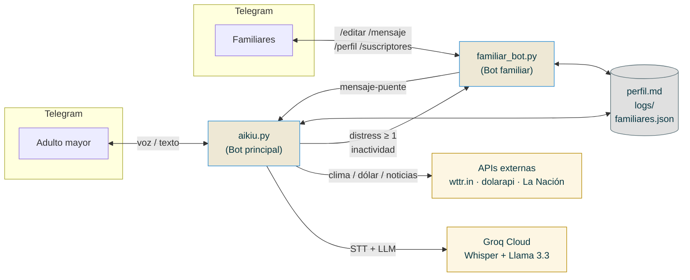
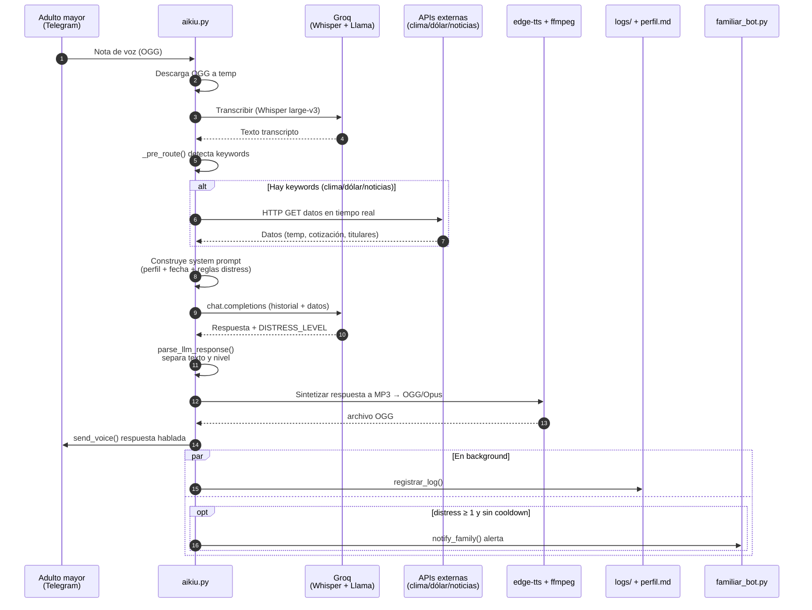
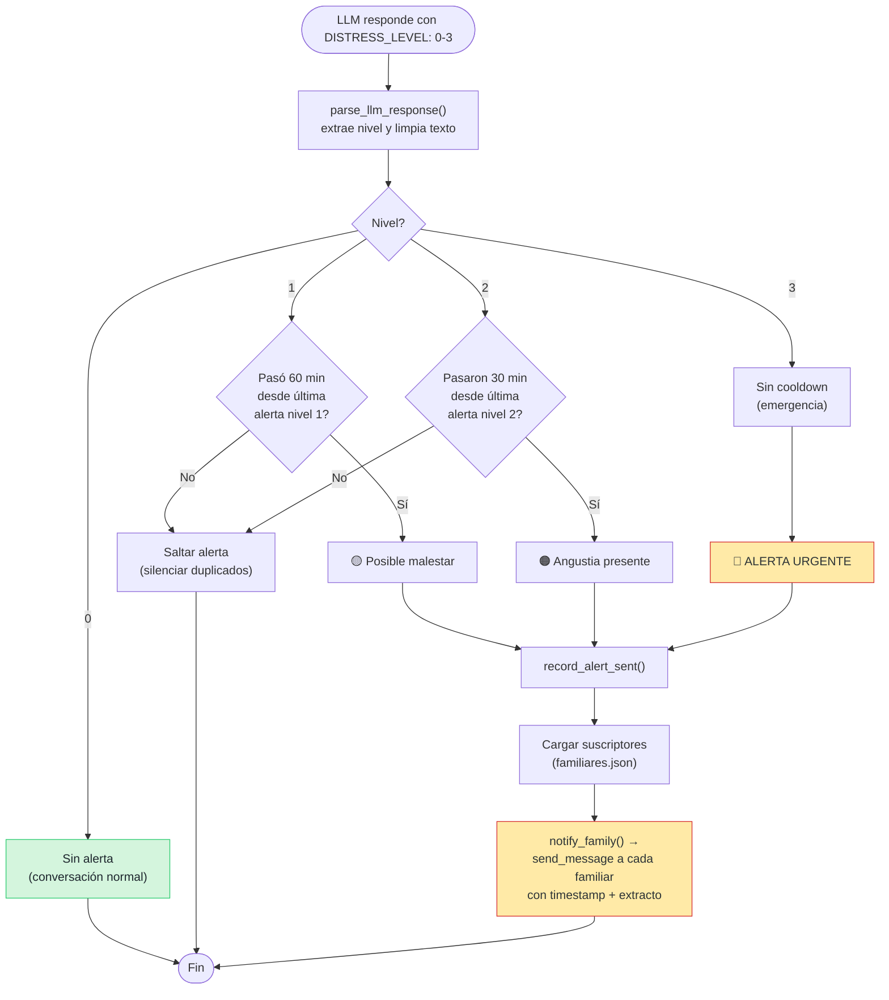
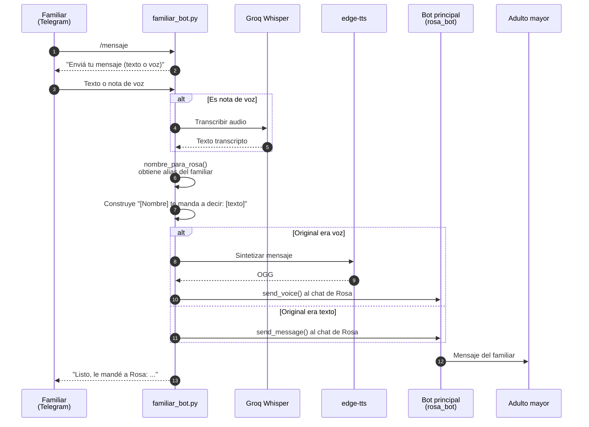
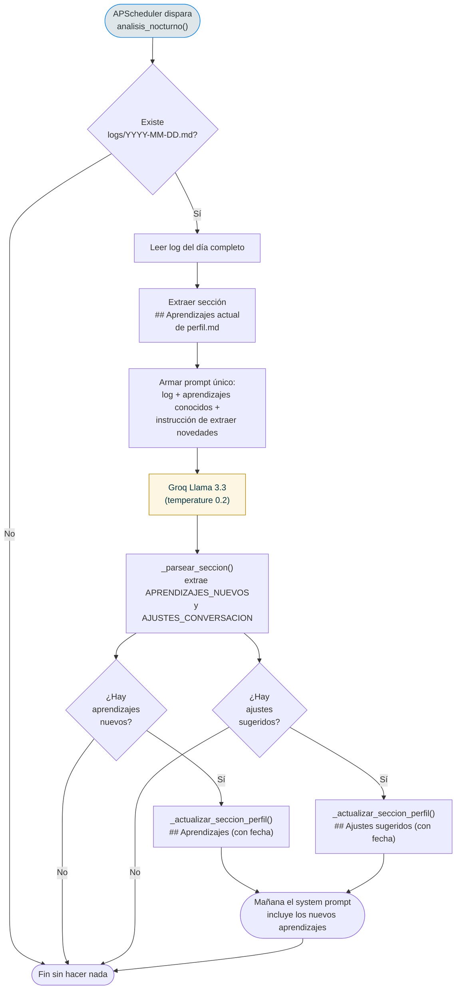
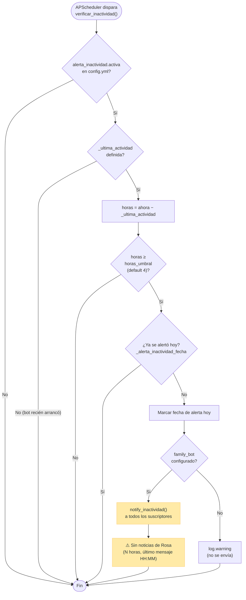
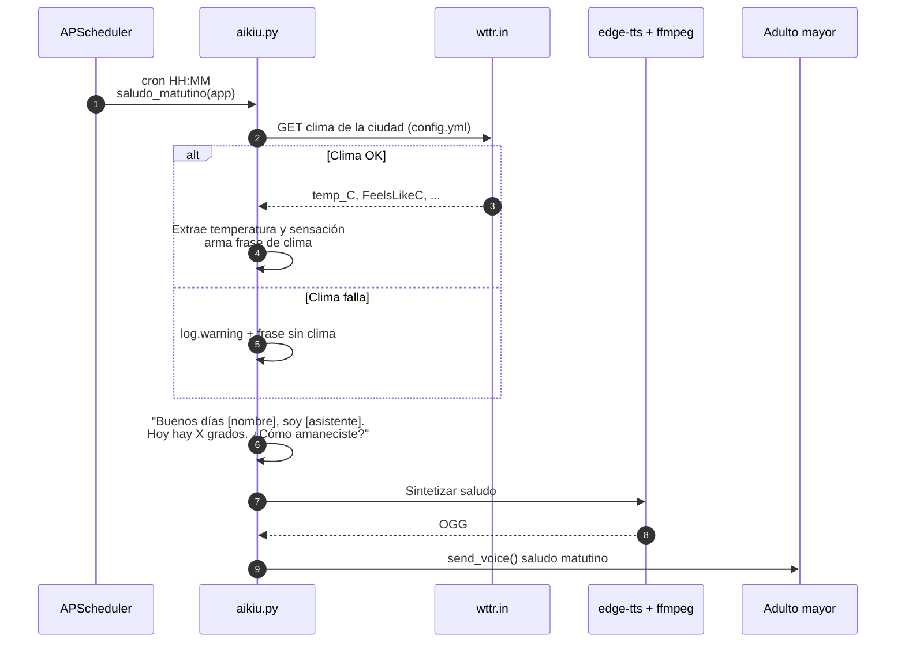

# Aikiu

> Asistente de voz para adultos mayores vía Telegram, con detección de angustia y alertas a la familia.

Aikiu es un compañero conversacional pensado para personas mayores que viven solas. Recibe y responde mensajes de voz por Telegram, mantiene una conversación cálida en español rioplatense, recuerda detalles personales, y avisa a los familiares si detecta señales de soledad, dolor o emergencia.

No requiere hardware especial: corre en cualquier computadora con Python.

---

## Tabla de contenidos

1. [Visión general](#visión-general)
2. [Funcionalidades](#funcionalidades)
3. [Arquitectura](#arquitectura)
4. [Diagramas de flujo](#diagramas-de-flujo)
5. [Stack técnico](#stack-técnico)
6. [Estructura del repositorio](#estructura-del-repositorio)
7. [Requisitos previos](#requisitos-previos)
8. [Instalación](#instalación)
9. [Configuración](#configuración)
10. [Uso](#uso)
11. [Comandos del bot familiar](#comandos-del-bot-familiar)
12. [Sistema de detección de angustia](#sistema-de-detección-de-angustia)
13. [Memoria y aprendizaje continuo](#memoria-y-aprendizaje-continuo)
14. [Consultas externas (clima, dólar, noticias)](#consultas-externas-clima-dólar-noticias)
15. [Recordatorios y mensajes proactivos](#recordatorios-y-mensajes-proactivos)
16. [Tests](#tests)
17. [Seguridad y privacidad](#seguridad-y-privacidad)
18. [Roadmap](#roadmap)
19. [Licencia](#licencia)

---

## Visión general

Aikiu está compuesto por **dos bots de Telegram** que trabajan en conjunto:

| Bot | Para quién | Propósito |
|---|---|---|
| **Bot principal (`aikiu.py`)** | El adulto mayor | Recibe voz/texto, responde con voz/texto, detecta angustia |
| **Bot familiar (`familiar_bot.py`)** | Familia y cuidadores | Recibe alertas, edita el perfil, envía mensajes-puente |

El adulto mayor solo necesita hablarle al bot principal como si fuese una persona. La familia gestiona el contexto y recibe avisos cuando algo no anda bien.

---

## Funcionalidades

### Conversación natural

- **Entrada por voz**: transcribe mensajes de audio con Whisper large-v3.
- **Respuesta por voz**: sintetiza el texto generado por el LLM con `edge-tts` y lo envía como nota de voz nativa de Telegram (formato OGG/Opus).
- **Modo dual**: si el usuario escribe texto, el bot responde con texto; si manda voz, responde con voz.
- **Memoria de sesión**: mantiene los últimos 10 mensajes de la conversación.
- **Personalidad configurable**: tono, vocabulario, restricciones y temas se definen en `perfil.md` en lenguaje natural.

### Detección de angustia y alertas

- El LLM clasifica cada respuesta con un nivel de angustia **DISTRESS_LEVEL** de 0 a 3 (oculto al usuario).
- Si el nivel supera 0, el bot familiar recibe automáticamente una alerta con timestamp, lo que dijo el usuario y la respuesta de Aikiu.
- Cooldowns para evitar spam: 60 min (nivel 1), 30 min (nivel 2), inmediato (nivel 3).

### Alerta de inactividad

- Si el usuario lleva más de N horas sin escribir, la familia recibe un aviso amable (no alarmista).
- Umbral configurable (default 4 h), checks dos veces por día.
- Una sola alerta por día para evitar saturación.

### Aprendizaje continuo

- **Log diario**: cada conversación queda en `logs/YYYY-MM-DD.md`.
- **Análisis nocturno** (default 23:30): un job lee el log del día y, con un único llamado al LLM, extrae aprendizajes nuevos sobre la persona y sugerencias para mejorar las próximas charlas. Los escribe en `perfil.md` bajo las secciones `## Aprendizajes` y `## Ajustes sugeridos`.

### Consultas en tiempo real

- **Clima** (wttr.in): temperatura, sensación, descripción, humedad.
- **Dólar** (dolarapi.com): blue y oficial, compra y venta.
- **Noticias** (RSS de La Nación): top titulares, filtrables por tema.

Pre-routing determinístico por keywords: la consulta a la API ocurre **antes** del llamado al LLM, así el modelo recibe los datos reales en su contexto y no inventa valores.

### Recordatorios proactivos

- **Saludo matutino diario** con la temperatura actual de la ciudad configurada.
- **Recordatorios programados** (ej. medicación, descanso) con hora y mensaje personalizables en `config.yml`.

### Bot familiar

- Cualquier familiar manda `/start` y queda suscripto a las alertas.
- Puede editar el perfil sección por sección con un menú interactivo (`/editar`).
- Puede enviarle mensajes-puente al adulto mayor en texto o voz (`/mensaje`), preservando el medio (texto → texto, voz → voz sintetizada con el nombre del remitente).
- Ver lista de suscriptores, perfil completo, ayuda, etc.

---

## Arquitectura



---

## Diagramas de flujo

### Flujo 1 — Mensaje de voz (entrada → respuesta)

Desde que el adulto mayor envía una nota de voz hasta que recibe la respuesta de Aikiu.



### Flujo 2 — Detección de angustia y alerta

Cómo se clasifica el riesgo emocional y cuándo se dispara la alerta a los familiares.



### Flujo 3 — Mensaje-puente del familiar (`/mensaje`)

Un familiar le envía algo al adulto mayor usando el bot familiar; Aikiu lo entrega preservando el medio.



### Flujo 4 — Análisis nocturno (aprendizaje continuo)

Job programado (default 23:30) que extrae aprendizajes nuevos y mejoras de conversación a partir del log del día.



### Flujo 5 — Alerta de inactividad

Checks programados (default 11:30 y 19:00) que avisan a la familia si el adulto mayor lleva varias horas sin escribir.



### Flujo 6 — Saludo matutino proactivo

Cada mañana a la hora configurada (`saludo_diario.hora`), Aikiu inicia la conversación con la temperatura del día.



---

## Stack técnico

| Componente | Tecnología |
|---|---|
| Lenguaje | Python 3.11+ |
| Mensajería | python-telegram-bot 21.6 |
| STT (voz → texto) | Groq Whisper large-v3 |
| LLM | Groq llama-3.3-70b-versatile |
| TTS (texto → voz) | edge-tts + ffmpeg (OGG/Opus) |
| Scheduler | APScheduler 3.10 |
| Cliente HTTP | httpx (async) |
| Configuración | PyYAML + python-dotenv |
| Tests | pytest (111 tests unitarios) |

Dependencias completas en [`requirements.txt`](./requirements.txt).

---

## Estructura del repositorio

```
aikiu/
├── aikiu.py                # Bot principal: STT + LLM + TTS + scheduler
├── familiar_bot.py         # Bot familiar: alertas, edición de perfil, mensajes-puente
├── configurar.py           # Wizard interactivo para generar perfil.md
├── core/
│   ├── distress.py         # Parsing del DISTRESS_LEVEL y lógica de cooldowns
│   ├── alerts.py           # Envío de alertas (distress + inactividad) a familiares
│   ├── tools.py            # Consultas externas: clima, dólar, noticias
│   └── tts.py              # Síntesis de voz con edge-tts + conversión a Opus
├── tests/                  # 111 tests unitarios + checklist E2E manual
├── config.yml              # Config no sensible (nombres, voz, horarios, recordatorios)
├── perfil.md               # Perfil del adulto mayor en lenguaje natural
├── requirements.txt        # Dependencias Python
├── .env.example            # Plantilla de variables de entorno
├── setup.sh                # Instala dependencias en venv (macOS / Linux)
├── start.sh                # Arranca ambos bots en paralelo
├── configurar.sh           # Atajo: corre configurar.py dentro del venv
└── ROADMAP.md              # Estado del proyecto y backlog
```

---

## Requisitos previos

1. **Python 3.11 o superior** (el desarrollo se hace sobre 3.14).
2. **ffmpeg** instalado y disponible en el `PATH` (se usa para convertir MP3 → OGG/Opus).
   - macOS: `brew install ffmpeg`
   - Ubuntu/Debian: `sudo apt install ffmpeg`
   - Windows: descargar desde [ffmpeg.org](https://ffmpeg.org/) y agregarlo al `PATH`.
3. **Cuenta gratuita de [Groq](https://console.groq.com/)** para obtener una API key.
4. **Uno o dos bots de Telegram** creados con [@BotFather](https://t.me/BotFather):
   - El bot principal (obligatorio).
   - Un segundo bot para la familia (opcional pero recomendado, habilita las alertas y el panel de edición).
5. El **chat ID de Telegram** del adulto mayor. Una forma rápida de obtenerlo: enviarle un mensaje al bot y consultar `https://api.telegram.org/bot<TOKEN>/getUpdates`.

---

## Instalación

### macOS / Linux

```bash
git clone https://github.com/geermaanv/aikiu.git
cd aikiu
bash setup.sh
```

El script:
- Verifica Python.
- Crea un entorno virtual en `./venv`.
- Instala las dependencias de `requirements.txt`.
- Copia `.env.example` a `.env` si no existe y te avisa qué falta completar.

### Windows / Manual

```powershell
git clone https://github.com/geermaanv/aikiu.git
cd aikiu
python -m venv venv
venv\Scripts\activate
pip install -r requirements.txt
copy .env.example .env
```

---

## Configuración

### 1. Variables de entorno (`.env`)

Editá `.env` y completá:

```bash
BOT_TOKEN=...                 # Bot principal (BotFather)
CHAT_ID=...                   # chat_id del adulto mayor
GROQ_API_KEY=...              # console.groq.com

# Opcional pero recomendado: bot familiar
FAMILIAR_BOT_TOKEN=...        # Segundo bot (BotFather)
FAMILIAR_CHAT_ID=...          # chat_id de un familiar de fallback
```

### 2. Configuración no sensible (`config.yml`)

```yaml
nombre_adulto_mayor: "Marta"
nombre_asistente: "Clara"
ciudad: "Olivos, Buenos Aires"
perfil: "perfil.md"
voz_tts: "es-AR-ElenaNeural"          # opciones: es-AR-TomasNeural, es-ES-ElviraNeural, etc.
modelo_llm: "llama-3.3-70b-versatile"

saludo_diario:
  activo: true
  hora: "08:30"

analisis_nocturno_hora: "23:30"

alerta_inactividad:
  activa: true
  horas_umbral: 4
  checks: ["11:30", "19:00"]

recordatorios:
  - hora: "09:00"
    mensaje: "Marta, ¿tomaste el medicamento de la mañana?"
  - hora: "21:00"
    mensaje: "Marta, ¿cómo estuvo tu día? Ya es tarde, pensá en descansar."
```

### 3. Perfil del adulto mayor (`perfil.md`)

Editalo a mano o, mejor, usá el wizard interactivo:

```bash
bash configurar.sh
```

El wizard pregunta paso a paso por: identidad, familia, gustos, salud, temas a tratar con cuidado y reglas del asistente. Genera `perfil.md` automáticamente.

`perfil.md` es lenguaje natural editable: el LLM lo lee como contexto. Cuanto más concreto y específico, mejor. Las secciones son:

- `## Quién es`
- `## Familia y contactos cercanos`
- `## Gustos y temas que la alegran`
- `## Salud (para contexto, no para diagnosticar)`
- `## Cómo hablarle`
- `## Temas a manejar con cuidado`
- `## Lo que nunca debe hacer [asistente]`
- `## Aprendizajes` *(auto-generada por el análisis nocturno)*
- `## Ajustes sugeridos` *(auto-generada por el análisis nocturno)*

---

## Uso

### Arrancar los bots

```bash
bash start.sh
```

Arranca el bot principal y, si `FAMILIAR_BOT_TOKEN` está configurado, también el bot familiar. Ctrl+C detiene ambos.

### Hablar con el bot principal

Desde Telegram, el adulto mayor:

- Envía `/start` la primera vez para recibir el saludo.
- Habla con notas de voz (recomendado) o texto.
- El bot responde en el mismo medio.

No hay menús ni comandos: es conversación pura.

---

## Comandos del bot familiar

| Comando | Descripción |
|---|---|
| `/start` | Registra al familiar como suscriptor de alertas. |
| `/nombre [Tu nombre]` | Registra cómo te conoce el adulto mayor (se usa al mandar mensajes-puente). |
| `/mensaje` | Inicia el envío de un mensaje texto/voz que Aikiu le transmite al adulto mayor de tu parte. |
| `/perfil` | Muestra el perfil completo actual. |
| `/editar` | Menú interactivo para editar una sección del perfil. |
| `/suscriptores` | Lista los familiares registrados. |
| `/ayuda` | Muestra la ayuda. |
| `/cancelar` | Cancela la operación en curso. |

Todas las alertas (angustia, inactividad) llegan a **todos** los suscriptores.

---

## Sistema de detección de angustia

El LLM debe terminar **cada** respuesta con una línea oculta:

```
DISTRESS_LEVEL: [0-3]
```

Esta línea es removida por `core/distress.py` antes de mostrar/sintetizar la respuesta, así que el usuario nunca la ve ni la escucha.

### Niveles

| Nivel | Significado | Cooldown |
|---|---|---|
| **0** | Conversación normal, saludo, pregunta informativa. Ambiguos → 0. | — |
| **1** | Expresión emocional explícita: "me siento sola", "estoy triste", "no pude dormir", "extraño a [alguien]". | 60 min |
| **2** | Llanto, malestar fuerte, dolor persistente, confusión, caída reciente, "soy una carga", no querer molestar. | 30 min |
| **3** | Emergencia activa: no puede moverse, dolor de pecho, no puede respirar, pide ayuda urgente. | 0 (inmediato) |

### Reglas

- La clasificación se basa **únicamente en el último mensaje del usuario**, no en el historial.
- Ante duda entre dos niveles, se asigna el menor (criterio conservador).
- Si el LLM omite la línea por error, se asume nivel 0 (el sistema nunca falla por esto).
- Las alertas se envían en background para no bloquear la respuesta al adulto mayor.

### Mensajes a la familia

```
🟡 [usuario] mencionó algo que podría indicar que no está del todo bien.    (nivel 1)
🟠 [usuario] parece estar angustiada ahora mismo.                            (nivel 2)
🔴 ALERTA: [usuario] puede necesitar ayuda urgente.                          (nivel 3)
```

Cada alerta incluye timestamp, fragmento de lo que dijo el adulto mayor y la respuesta del asistente.

---

## Memoria y aprendizaje continuo

### Log diario

Cada intercambio se guarda en `logs/YYYY-MM-DD.md`:

```markdown
# Conversaciones del 16/05/2026

**08:32**
- Marta: Buen día, ¿cómo estás?
- Clara: Buen día Marta, todo bien por acá. ¿Cómo amaneciste?
```

### Análisis nocturno

Job programado a las 23:30 (configurable). En un único llamado al LLM:

1. Lee el log del día completo.
2. Lo compara con la sección `## Aprendizajes` ya existente en `perfil.md`.
3. Extrae **aprendizajes nuevos** (datos concretos: eventos, salud, familia, gustos) que no estén ya registrados.
4. Detecta **patrones problemáticos** en la conversación y sugiere ajustes (`## Ajustes sugeridos`).
5. Reescribe esas dos secciones en `perfil.md` con fecha.

Resultado: el bot va aprendiendo sobre la persona sin requerir intervención manual, y los aprendizajes alimentan el system prompt del día siguiente.

---

## Consultas externas (clima, dólar, noticias)

Implementadas en `core/tools.py`. El pre-routing en `aikiu.py::_pre_route()` detecta palabras clave en el mensaje del usuario **antes** de llamar al LLM y obtiene los datos:

| Tema | Fuente | Keywords detectadas |
|---|---|---|
| Clima | `wttr.in` | clima, tiempo, temperatura, grados, llueve, lluvia, frío, calor, pronóstico, nublado, viento, humedad |
| Dólar | `dolarapi.com` | dólar, cotización, tipo de cambio, cambio, billete |
| Noticias | RSS de La Nación | noticias, qué pasó, novedades, titulares, hoy qué |

El resultado se inyecta como mensaje de sistema antes del turno del usuario para que el LLM responda con valores reales y no alucine.

Si la API falla, se devuelve un mensaje amigable y la conversación sigue.

> **Nota:** `core/tools.py` también define los esquemas en formato OpenAI tool-calling (`TOOLS` y `ejecutar_tool`), listos para migrar a tool-calling nativo cuando se desee.

---

## Recordatorios y mensajes proactivos

Gestionados por **APScheduler** dentro del loop async del bot:

- **Saludo matutino** (`saludo_matutino`): obtiene la temperatura de la ciudad configurada y envía una nota de voz personalizada.
- **Recordatorios cron** (`recordatorios` en `config.yml`): envía notas de voz a las horas indicadas.
- **Análisis nocturno** (`analisis_nocturno`): job diario a la hora configurada.
- **Checks de inactividad** (`verificar_inactividad`): dos veces por día por defecto.

Todos se inicializan en `programar_recordatorios()` al arrancar el bot.

---

## Tests

```bash
source venv/bin/activate
pytest
```

**111 tests unitarios** cubren:

- `core/distress.py`: parsing del LLM, cooldowns por nivel, casos borde.
- `core/tools.py`: dispatcher, parsing RSS (CDATA + fallback), filtro por tema, manejo de errores HTTP.
- `core/alerts.py` + `verificar_inactividad`: umbral, cooldown diario, baseline, mensaje a familiares.
- `aikiu.analisis_nocturno`: parsing de secciones, deduplicación de aprendizajes, fallo del LLM sin romper.
- Saludo matutino: extracción de temperatura, fallback sin clima.
- Lógica de perfil: lectura/escritura de secciones, suscriptores.
- Reglas del system prompt: pre-routing, anti-alucinación de mensajes de familiares, criterios de distress.

Hay también un **checklist E2E manual** en [`tests/checklist.md`](./tests/checklist.md).

Se recomienda configurar un git pre-commit hook para correr los tests antes de cada commit.

---

## Seguridad y privacidad

- **Secretos en `.env`**, nunca en el repo. `.env` está en `.gitignore`.
- **Autorización por chat_id**: el bot principal sólo responde al `CHAT_ID` configurado.
- **`familiares.json` y `subscribers.json`** (datos personales de los familiares) están en `.gitignore`.
- **`logs/`** (transcripciones de conversaciones) está en `.gitignore`.
- **Sin servidor propio**: todo el procesamiento de IA ocurre en Groq Cloud. Esto implica que las transcripciones y mensajes se envían a Groq; ver [términos de uso de Groq](https://groq.com/terms-of-use) si esto es una consideración.
- En el roadmap está prevista una capa opcional de **sanitización local** de datos sensibles antes del envío al LLM.

---

## Roadmap

Resumen del [ROADMAP.md](./ROADMAP.md):

### Alta prioridad
- Resumen diario al familiar (cada noche, vía Telegram).
- Comando `/log` en el bot familiar.

### Media prioridad
- Más variedad temática en la conversación.
- Historial persistente entre reinicios.
- Métricas de aislamiento (alerta silenciosa si el volumen de mensajes cae).

### Ideas
- Sanitización local de datos sensibles antes de enviar al LLM.
- Voz más natural (ElevenLabs u otro proveedor).
- Configurador vía Telegram (sin tocar archivos).
- Panel web para perfil y logs.

---

## Licencia

MIT © 2026 Germán Villamarin. Ver [LICENSE](./LICENSE).
