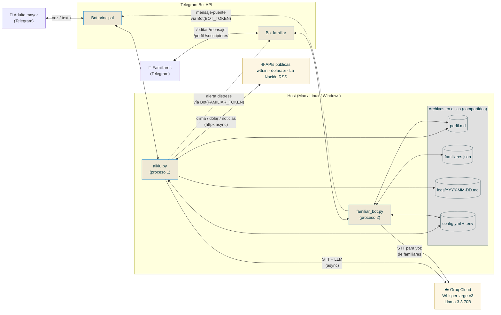
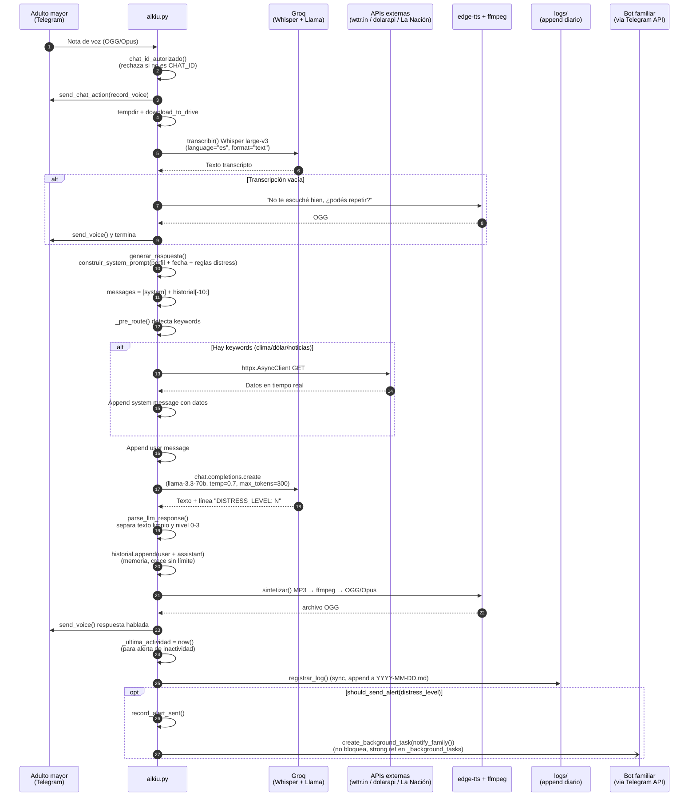
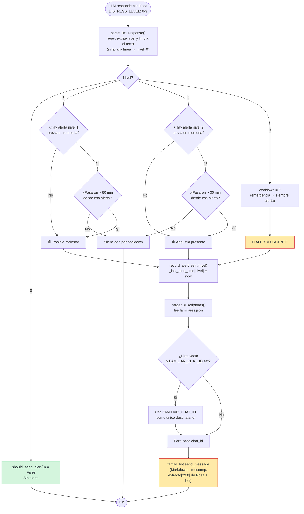
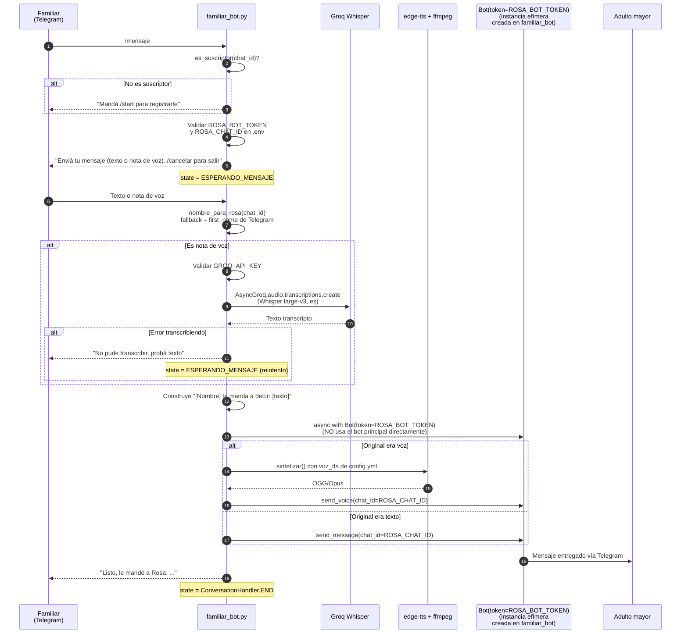
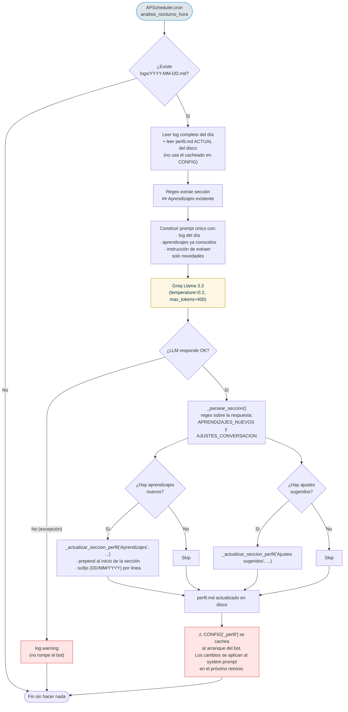
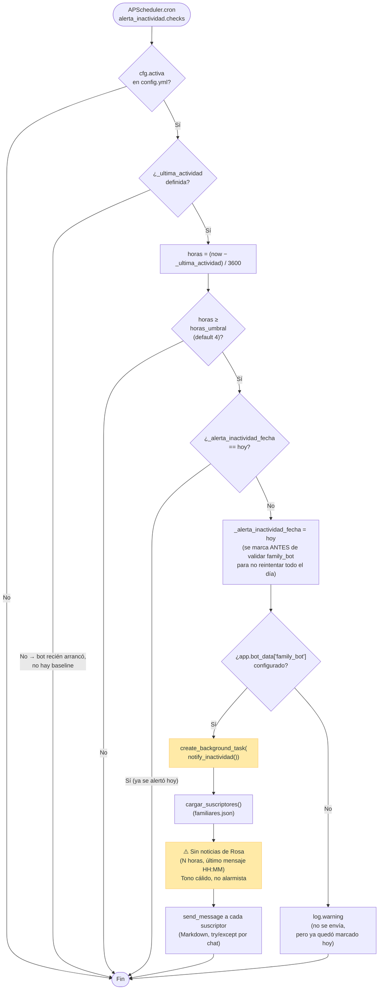
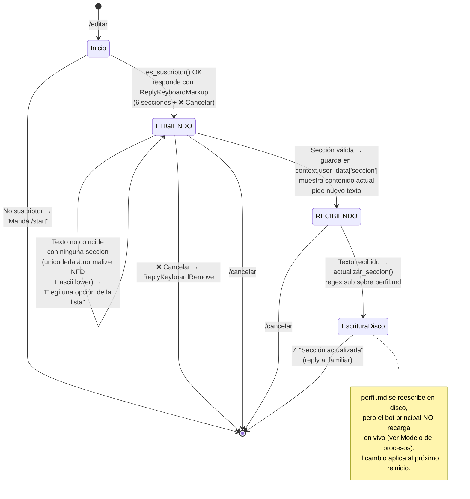
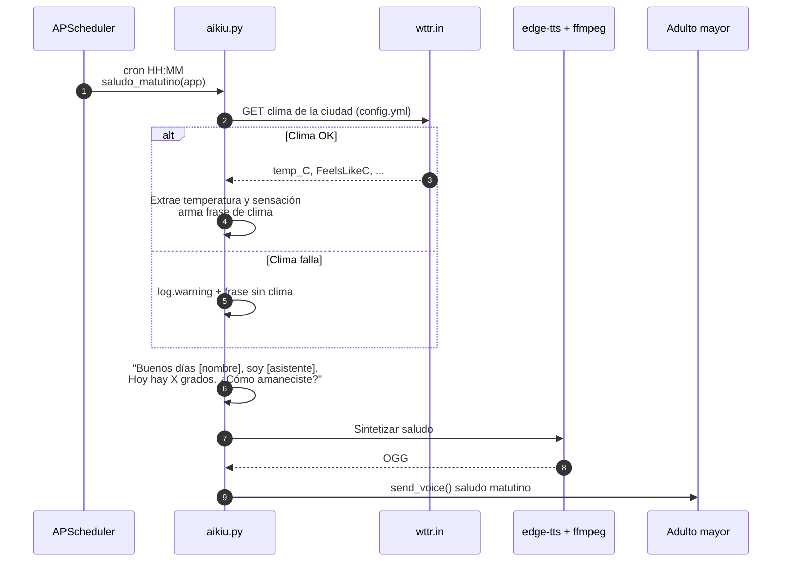
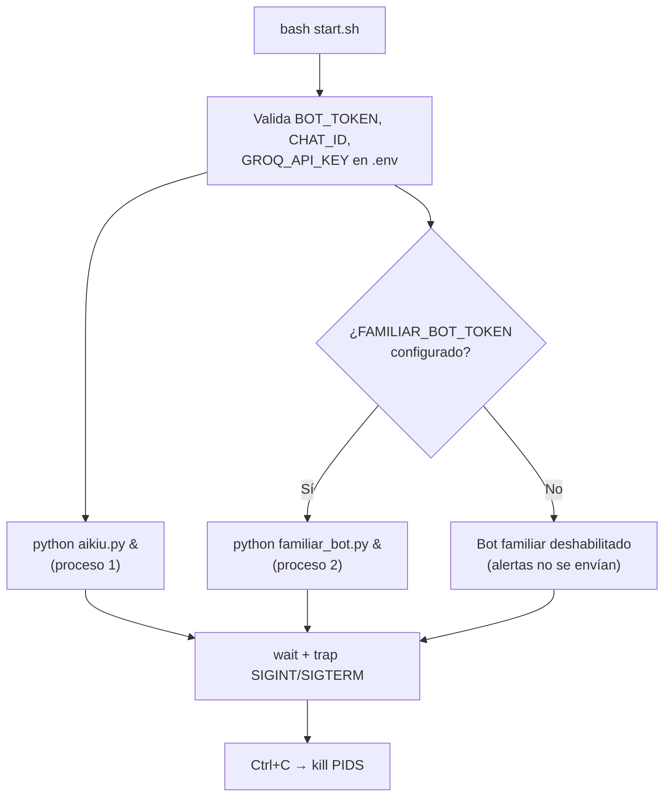

<div align="center">


### La tranquilidad de estar conectado · Sin comprar nada

# Sabés que está bien.

**Aikiu acompaña a tu adulto mayor durante el día y te avisa si algo no está como debería.**
Sin comprar ningún dispositivo. Sin costo mensual para empezar.
Solo necesitás el celular que ya tiene. Nada más.

📱 **[Ver demo animado del flujo](./demo/index.html)** — abrí en cualquier navegador

</div>

---

## ¿Qué es Aikiu?

Aikiu es un compañero conversacional vía **Telegram** pensado para personas mayores que viven solas. Recibe y responde mensajes de voz, mantiene una conversación cálida en español rioplatense, recuerda detalles personales, y **avisa a los familiares** si detecta señales de soledad, dolor o emergencia.

No requiere hardware especial, ni suscripciones, ni instalar nada en el teléfono del adulto mayor: corre en cualquier computadora con Python y se conecta a Telegram, una app que la persona probablemente ya usa.

### Visión

Que ninguna familia tenga que elegir entre **gastar miles de dólares en dispositivos especializados** o **quedarse sin saber cómo está su ser querido**. La tecnología para acompañar ya existe en cualquier celular — solo hace falta orquestarla con criterio y cariño.

### Misión

Construir un acompañante de IA **abierto, gratuito y respetuoso**, que:

- Use solo herramientas que **ya tiene la persona** (un celular con Telegram).
- Sea **invisible para el adulto mayor**: nada de configurar, instalar o aprender. Solo hablar.
- Dé a la familia **señales tempranas y honestas**, sin alarmar de más ni minimizar.
- Aprenda de cada conversación para sonar **menos a bot y más a familiar cercano**.
- Sea **transparente**: código abierto, sin cajas negras, sin datos médicos certificados que vender.

---

## Tabla de contenidos

1. [Cómo funciona](#cómo-funciona)
2. [Funcionalidades](#funcionalidades)
3. [Arquitectura](#arquitectura)
4. [Diagramas de flujo](#diagramas-de-flujo)
5. [Stack técnico](#stack-técnico)
6. [Modelo de procesos y persistencia](#modelo-de-procesos-y-persistencia)
7. [Estructura del repositorio](#estructura-del-repositorio)
8. [Requisitos previos](#requisitos-previos)
9. [Instalación](#instalación)
10. [Configuración](#configuración)
11. [Uso](#uso)
12. [Comandos del bot familiar](#comandos-del-bot-familiar)
13. [Comandos del bot admin](#comandos-del-bot-admin)
14. [Sistema de detección de angustia](#sistema-de-detección-de-angustia)
15. [Memoria y aprendizaje continuo](#memoria-y-aprendizaje-continuo)
16. [Consultas externas (clima, dólar, noticias)](#consultas-externas-clima-dólar-noticias)
17. [Recordatorios y mensajes proactivos](#recordatorios-y-mensajes-proactivos)
18. [Andromarta — humanoide sintético para testing](#andromarta--humanoide-sintético-para-testing)
19. [Tests](#tests)
20. [Seguridad y privacidad](#seguridad-y-privacidad)
21. [Roadmap](#roadmap)
22. [Licencia](#licencia)

---

## Cómo funciona

Aikiu está compuesto por **tres bots de Telegram** que trabajan en conjunto:

| Bot | Para quién | Propósito |
|---|---|---|
| **Bot principal (`aikiu.py`)** | El adulto mayor | Recibe voz/texto, responde con voz/texto, detecta angustia |
| **Bot familiar (`familiar_bot.py`)** | Familia y cuidadores | Recibe alertas, edita el perfil, envía mensajes-puente |
| **Bot admin (`admin/bot.py`)** | Equipo operador (hasta 5) | Monitorea salud, uso del LLM y métricas de cada instancia |

Hay además un cliente sintético opcional (`andromarta/bot.py`) que se hace pasar por un adulto mayor para testear Aikiu end-to-end. No es un bot: es un cliente de usuario MTProto. Ver [Andromarta](#andromarta--humanoide-sintético-para-testing).

El adulto mayor solo necesita hablarle al bot principal como si fuese una persona. La familia gestiona el contexto y recibe avisos cuando algo no anda bien. El bot admin es opcional: si configurás `ADMIN_BOT_TOKEN`, te da `/health`, `/llm` y `/metricas` vía Telegram, y soporta hasta 5 chat_ids (un equipo operador) por default.

---

## Funcionalidades

### Conversación natural

- **Entrada por voz**: transcribe mensajes de audio con Whisper large-v3.
- **Respuesta por voz**: sintetiza el texto generado por el LLM con `edge-tts` y lo envía como nota de voz nativa de Telegram (formato OGG/Opus).
- **Modo dual**: si el usuario escribe texto, el bot responde con texto; si manda voz, responde con voz.
- **Memoria de sesión**: mantiene los últimos 10 mensajes de la conversación.
- **Personalidad configurable**: tono, vocabulario, restricciones y temas se definen en `perfil.md` en lenguaje natural.

### Detección de angustia y alertas

- El LLM clasifica cada respuesta con un nivel de angustia **DISTRESS_LEVEL** de 0 a 3 (oculto al usuario).
- Si el nivel supera 0, el bot familiar recibe automáticamente una alerta con timestamp, lo que dijo el usuario y la respuesta de Aikiu.
- Cooldowns para evitar spam: 60 min (nivel 1), 30 min (nivel 2), inmediato (nivel 3).

### Alerta de inactividad

- Si el usuario lleva más de N horas sin escribir, la familia recibe un aviso amable (no alarmista).
- Umbral configurable (default 4 h), checks dos veces por día.
- Una sola alerta por día para evitar saturación.

### Aprendizaje continuo

- **Log diario**: cada conversación queda en `logs/YYYY-MM-DD.md`.
- **Análisis nocturno** (default 23:30): un job lee el log del día y, con un único llamado al LLM, extrae aprendizajes nuevos sobre la persona y sugerencias para mejorar las próximas charlas. Los escribe en `perfil.md` bajo las secciones `## Aprendizajes` y `## Ajustes sugeridos`.

### Consultas en tiempo real

- **Clima** (wttr.in): temperatura, sensación, descripción, humedad.
- **Dólar** (dolarapi.com): blue y oficial, compra y venta.
- **Noticias** (RSS de La Nación): top titulares, filtrables por tema.

Pre-routing determinístico por keywords: la consulta a la API ocurre **antes** del llamado al LLM, así el modelo recibe los datos reales en su contexto y no inventa valores.

### Recordatorios proactivos

- **Saludo matutino diario** con la temperatura actual de la ciudad configurada.
- **Recordatorios programados** (ej. medicación, descanso) con hora y mensaje personalizables en `config.yml`.

### Bot familiar

- Cualquier familiar manda `/start` y queda suscripto a las alertas.
- Puede editar el perfil sección por sección con un menú interactivo (`/editar`).
- Puede enviarle mensajes-puente al adulto mayor en texto o voz (`/mensaje`), preservando el medio (texto → texto, voz → voz sintetizada con el nombre del remitente).
- Ver lista de suscriptores, perfil completo, ayuda, etc.

---

## Arquitectura

Dos procesos Python independientes, sin servidor propio, sin base de datos. Ambos hacen **long-polling** a Telegram y comparten estado mediante archivos en disco. La comunicación entre los dos bots ocurre **a través de la API de Telegram**, no por IPC interno.



**Puntos clave:**
- Los dos bots de Telegram son cuentas distintas creadas en BotFather y reciben actualizaciones por long-polling (`drop_pending_updates=True`).
- Para enviarle alertas al bot familiar, `aikiu.py` crea su propia instancia `Bot(token=FAMILIAR_BOT_TOKEN)` y la guarda en `app.bot_data["family_bot"]`.
- Para enviarle mensajes-puente al bot principal, `familiar_bot.py` instancia `Bot(token=ROSA_BOT_TOKEN)` on-demand dentro de un `async with`.
- No hay IPC ni base de datos: el estado persistente es `perfil.md`, `familiares.json` y `logs/`.
- El estado en memoria (historial, `_ultima_actividad`, cooldowns, fecha de última alerta de inactividad) se pierde al reiniciar el bot.

---

## Diagramas de flujo

### Flujo 1 — Mensaje de voz (entrada → respuesta)

Desde que el adulto mayor envía una nota de voz hasta que recibe la respuesta de Aikiu. Refleja `handle_message()` + `generar_respuesta()` en `aikiu.py`.



### Flujo 2 — Detección de angustia y alerta

Cómo se clasifica el riesgo emocional y cuándo se dispara la alerta a los familiares. Refleja `core/distress.py` + `core/alerts.py`.



### Flujo 3 — Mensaje-puente del familiar (`/mensaje`)

Un familiar le envía algo al adulto mayor usando el bot familiar; Aikiu lo entrega preservando el medio. Refleja `cmd_mensaje` + `recibir_mensaje_familiar` en `familiar_bot.py`, dentro de una `ConversationHandler` (estado `ESPERANDO_MENSAJE`).



### Flujo 4 — Análisis nocturno (aprendizaje continuo)

Job programado (default 23:30) que extrae aprendizajes nuevos y mejoras de conversación a partir del log del día. Refleja `analisis_nocturno()` en `aikiu.py`.



> **Nota técnica:** `perfil.md` es leído una sola vez al arranque del bot principal (`cargar_config()` → `CONFIG["_perfil"]`). El análisis nocturno escribe el archivo en disco, y los cambios entran al system prompt **al próximo reinicio del bot** (no en vivo). Lo mismo aplica a las ediciones desde `/editar` del bot familiar.

### Flujo 5 — Alerta de inactividad

Checks programados (default 11:30 y 19:00) que avisan a la familia si el adulto mayor lleva varias horas sin escribir. Refleja `verificar_inactividad()` en `aikiu.py` + `notify_inactividad()` en `core/alerts.py`.



### Flujo 6 — Edición de perfil desde el bot familiar (`/editar`)

Conversación multi-estado para que un familiar actualice una sección de `perfil.md`. Refleja `cmd_editar`, `elegir_seccion`, `recibir_contenido` y `cancelar` en `familiar_bot.py`, dentro de una `ConversationHandler` con estados `ELIGIENDO` y `RECIBIENDO`.



**Secciones editables** (constante `SECCIONES`):

1. Quién es
2. Familia y contactos cercanos
3. Gustos y temas que la alegran
4. Salud (para contexto, no para diagnosticar)
5. Temas a manejar con cuidado
6. Reglas del asistente

### Flujo 7 — Saludo matutino proactivo

Cada mañana a la hora configurada (`saludo_diario.hora`), Aikiu inicia la conversación con la temperatura del día.



---

## Stack técnico

| Capa | Componente | Tecnología | Detalle de uso |
|---|---|---|---|
| Runtime | Lenguaje | Python 3.11+ | Probado en 3.14 sobre macOS |
| Runtime | Concurrencia | `asyncio` + `async/await` | Loop único por proceso; tasks en background con strong refs en `_background_tasks: set` para evitar GC prematuro |
| Mensajería | Telegram | `python-telegram-bot` 21.6 | Modo long-polling (`Application.builder()` + `updater.start_polling`), `drop_pending_updates=True` al arranque |
| Mensajería | Flujos conversacionales | `ConversationHandler` (PTB) | Estados `ELIGIENDO`, `RECIBIENDO`, `ESPERANDO_MENSAJE` en bot familiar (`/editar`, `/mensaje`) |
| IA — STT | Voz → texto | Groq Whisper `large-v3` | Vía `AsyncGroq`, `language="es"`, `response_format="text"` |
| IA — LLM | Conversación | Groq `llama-3.3-70b-versatile` | `temperature=0.7`, `max_tokens=300`, historial = últimos 10 turnos |
| IA — LLM | Análisis nocturno | Misma Llama 3.3 | `temperature=0.2`, `max_tokens=400`, una sola call por noche con todo el log + aprendizajes previos |
| IA — TTS | Texto → voz | `edge-tts` ≥ 6.1.9 | Voz `es-AR-ElenaNeural` por defecto; genera MP3 |
| Audio | Conversión a formato Telegram | `ffmpeg` (binario externo) | MP3 → OGG/Opus (`-c:a libopus`), formato nativo de voice notes |
| Programación | Jobs cron | APScheduler 3.10 `AsyncIOScheduler` | Saludo matutino, recordatorios, análisis nocturno, checks de inactividad |
| HTTP externo | Cliente | `httpx` ≥ 0.27 async | Timeout 8s para clima/dólar/noticias |
| APIs externas | Clima | wttr.in (`?format=j1`) | Temperatura, sensación térmica, humedad, descripción |
| APIs externas | Dólar | dolarapi.com | Blue y oficial, compra y venta |
| APIs externas | Noticias | RSS de La Nación | Top 4 titulares vía regex sobre `<title><![CDATA[…]]></title>`, con fallback a `<title>` plano |
| Config | Archivos | `PyYAML` + `python-dotenv` | `config.yml` no sensible + `.env` para secretos |
| Persistencia | Datos del usuario | `perfil.md` (texto plano) | Editable a mano o vía wizard / bot familiar / análisis nocturno |
| Persistencia | Suscriptores | `familiares.json` | `[{chat_id, nombre}]`, escrito atómicamente con `write_text` |
| Persistencia | Conversaciones | `logs/YYYY-MM-DD.md` | Append per turno con timestamp `HH:MM` |
| Persistencia | Logs del bot | `aikiu.log` | `logging.FileHandler` + stdout |
| Tests | Suite | `pytest` (111 tests unitarios) | Cobertura: distress, alertas, tools, análisis nocturno, saludo, perfil, reglas del system prompt |
| Despliegue | Orquestación | `bash start.sh` | Lanza ambos procesos Python en paralelo, `trap SIGINT/SIGTERM` para shutdown limpio |
| Seguridad | Autorización | Chat ID hardcodeado en `.env` | Bot principal rechaza cualquier `chat_id` distinto a `CHAT_ID` |

Dependencias completas en [`requirements.txt`](./requirements.txt).

---

## Modelo de procesos y persistencia

### Procesos en ejecución



Cada bot tiene:
- Su propio `Application` de `python-telegram-bot` con su propio `Updater` de long-polling.
- Su propio loop `asyncio` (uno por proceso).
- Su propio `AsyncIOScheduler` (solo el bot principal usa scheduler real; el familiar es reactivo a comandos).

### Estado en memoria vs. persistente

| Dato | Dónde vive | Sobrevive a reinicio | Acceso |
|---|---|---|---|
| `historiales[chat_id]` (conversación) | RAM de `aikiu.py` | No | Solo bot principal |
| `_ultima_actividad` | RAM de `aikiu.py` | No (sin baseline al arrancar) | Solo bot principal |
| `_last_alert_time[nivel]` (cooldowns distress) | RAM de `core/distress.py` | No | Solo bot principal |
| `_alerta_inactividad_fecha` | RAM de `aikiu.py` | No | Solo bot principal |
| `_background_tasks` (strong refs) | RAM de `aikiu.py` | No | Solo bot principal |
| `CONFIG["_perfil"]` (snapshot del perfil) | RAM de `aikiu.py` | No, **se cachea al arranque** | Solo bot principal |
| `perfil.md` | Disco | Sí | Ambos bots (lectura/escritura) |
| `familiares.json` | Disco | Sí | Ambos bots |
| `logs/YYYY-MM-DD.md` | Disco | Sí | Escribe bot principal; nadie lee programáticamente |
| `config.yml` + `.env` | Disco | Sí | Ambos bots (solo lectura) |

### Patrones de implementación

- **Background tasks con strong refs**: `aikiu.py::create_background_task()` agrega cada `asyncio.Task` a un `set` global y lo limpia en el callback de done. Sin esto, el GC podría cancelar tasks en vuelo (problema conocido de `asyncio.create_task` con refs débiles).
- **Tempdirs aislados**: tanto STT como TTS usan `tempfile.TemporaryDirectory()` por operación — no quedan archivos huérfanos.
- **Cliente Groq compartido por proceso**: una sola instancia `AsyncGroq` reutilizada para STT y LLM (HTTP keep-alive).
- **Pre-routing determinístico**: las consultas al mundo real se hacen por keyword-matching ANTES del LLM, no por tool calling. Garantiza que el LLM siempre vea los datos reales (no puede "olvidarse" de llamar la herramienta). Las definiciones tool-calling de OpenAI están en `core/tools.py::TOOLS` listas para migrar si se desea.
- **Anti-alucinación**: el system prompt incluye una instrucción explícita: si Rosa pregunta si alguien le escribió y no hay un mensaje real, debe responder "No recibí ningún mensaje para vos hoy."
- **Fail-soft**: el análisis nocturno y los fetch HTTP están envueltos en try/except con `log.warning`; ningún fallo de servicios externos rompe la respuesta al usuario.
- **No hay reload en vivo de perfil**: las ediciones desde `/editar` o el análisis nocturno escriben a disco pero entran al system prompt solo en el próximo arranque del bot principal (limitación conocida — ver Roadmap).

### Despliegue típico

- **macOS / Linux casero**: `bash start.sh` en una terminal, o como servicio systemd / launchd.
- **No requiere puerto abierto**: long-polling sale hacia Telegram, no recibe webhooks. Funciona detrás de NAT residencial sin configuración.
- **Sin contenedor por defecto**: el proyecto se ejecuta directo desde el venv. Dockerizar es trivial pero no está incluido.

---

## Estructura del repositorio

```
aikiu/
├── aikiu.py                # Bot principal: STT + LLM + TTS + scheduler
├── familiar_bot.py         # Bot familiar: alertas, edición de perfil, mensajes-puente
├── admin/                  # Bot admin (opcional): /health, /llm, /metricas, /logs
│   ├── bot.py              # Entry point del bot admin
│   ├── state.py            # Estado multi-admin (hasta 5 chat_ids)
│   ├── COMO_USAR.md        # Guía paso a paso para activarlo y usarlo desde el celular
│   ├── admin_state.json    # Lista de admins persistida (gitignored, runtime)
│   ├── heartbeat-admin.json # Heartbeat del admin bot (gitignored, runtime)
│   └── admin_stdout.log    # Stdout del admin bot (gitignored, runtime)
├── andromarta/             # Cliente sintético opcional, autocontenido (ver sección Andromarta)
├── configurar.py           # Wizard interactivo para generar perfil.md
├── core/
│   ├── distress.py         # Parsing del DISTRESS_LEVEL y lógica de cooldowns
│   ├── alerts.py           # Envío de alertas (distress + inactividad) a familiares
│   ├── tools.py            # Consultas externas: clima, dólar, noticias
│   ├── tts.py              # Síntesis de voz con edge-tts + conversión a Opus
│   ├── state.py            # TOFU del adulto mayor (state.json)
│   ├── instance.py         # Abstracción de instancia (single + multi-tenant)
│   ├── heartbeat.py        # Heartbeat por rol y por instancia
│   ├── llm_limits.py       # Catálogo de límites del free tier de Groq por modelo
│   └── usage.py            # Tracking de tokens y latencias de Groq
├── tests/                  # tests unitarios + checklist E2E manual
├── .cursor/rules/          # Reglas para el agente de Cursor (convenciones del repo)
├── config.yml              # Config no sensible (nombres, voz, horarios, recordatorios)
├── perfil.md               # Perfil del adulto mayor en lenguaje natural
├── requirements.txt        # Dependencias Python
├── .env.example            # Plantilla de variables de entorno
├── setup.sh                # Instala dependencias en venv (macOS / Linux)
├── start.sh                # Arranca ambos bots en paralelo
├── configurar.sh           # Atajo: corre configurar.py dentro del venv
└── ROADMAP.md              # Estado del proyecto y backlog
```

---

## Requisitos previos

1. **Python 3.11 o superior** (el desarrollo se hace sobre 3.14).
2. **ffmpeg** instalado y disponible en el `PATH` (se usa para convertir MP3 → OGG/Opus).
   - macOS: `brew install ffmpeg`
   - Ubuntu/Debian: `sudo apt install ffmpeg`
   - Windows: descargar desde [ffmpeg.org](https://ffmpeg.org/) y agregarlo al `PATH`.
3. **Cuenta gratuita de [Groq](https://console.groq.com/)** para obtener una API key.
4. **Uno o dos bots de Telegram** creados con [@BotFather](https://t.me/BotFather):
   - El bot principal (obligatorio).
   - Un segundo bot para la familia (opcional pero recomendado, habilita las alertas y el panel de edición).
5. El **chat ID de Telegram** del adulto mayor. Una forma rápida de obtenerlo: enviarle un mensaje al bot y consultar `https://api.telegram.org/bot<TOKEN>/getUpdates`.

---

## Instalación

### macOS / Linux

```bash
git clone https://github.com/geermaanv/aikiu.git
cd aikiu
bash setup.sh
```

El script:
- Verifica Python.
- Crea un entorno virtual en `./venv`.
- Instala las dependencias de `requirements.txt`.
- Copia `.env.example` a `.env` si no existe y te avisa qué falta completar.

### Windows / Manual

```powershell
git clone https://github.com/geermaanv/aikiu.git
cd aikiu
python -m venv venv
venv\Scripts\activate
pip install -r requirements.txt
copy .env.example .env
```

---

## Configuración

### 1. Variables de entorno (`.env`)

Editá `.env` y completá:

```bash
BOT_TOKEN=...                 # Bot principal (BotFather)
CHAT_ID=...                   # chat_id del adulto mayor
GROQ_API_KEY=...              # console.groq.com

# Opcional pero recomendado: bot familiar
FAMILIAR_BOT_TOKEN=...        # Segundo bot (BotFather)
FAMILIAR_CHAT_ID=...          # chat_id de un familiar de fallback

# Opcional: bot admin (vos + equipo, hasta 5) — habilita /health, /llm, /metricas
ADMIN_BOT_TOKEN=...           # Tercer bot (BotFather)
# Cada /start desde un chat distinto suma un admin nuevo hasta llenar el cupo
# (5 por default). Cuando se llena, el resto se rechaza en silencio.
# ADMIN_CHAT_IDS=111,222,333   # Opcional: fijar la lista por env (deshabilita /start y /quitar_admin).
# ADMIN_MAX_USERS=5            # Opcional: cambiar el cupo (default 5).
# GROQ_DAILY_TOKEN_LIMIT=100000 # Override manual del TPD para los avisos del admin (/llm). Si lo dejás sin setear, el admin usa el TPD del free tier de Groq por modelo desde core/llm_limits.py (ej. llama-3.3-70b-versatile = 100k TPD, llama-3.1-8b-instant = 500k TPD). Útil solo si tenés tier pago.

# Opcional: multi-tenant (preparado para varios adultos en una misma máquina)
# AIKIU_INSTANCE_ID=default
# AIKIU_REGISTRY=/var/aikiu/instances
```

### 2. Configuración no sensible (`config.yml`)

```yaml
nombre_adulto_mayor: "Marta"
nombre_asistente: "Clara"
ciudad: "Olivos, Buenos Aires"
perfil: "perfil.md"
voz_tts: "es-AR-ElenaNeural"          # opciones: es-AR-TomasNeural, es-ES-ElviraNeural, etc.
modelo_llm: "llama-3.3-70b-versatile"

saludo_diario:
  activo: true
  hora: "08:30"

analisis_nocturno_hora: "23:30"

alerta_inactividad:
  activa: true
  horas_umbral: 4
  checks: ["11:30", "19:00"]

recordatorios:
  - hora: "09:00"
    mensaje: "Marta, ¿tomaste el medicamento de la mañana?"
  - hora: "21:00"
    mensaje: "Marta, ¿cómo estuvo tu día? Ya es tarde, pensá en descansar."
```

### 3. Perfil del adulto mayor (`perfil.md`)

Editalo a mano o, mejor, usá el wizard interactivo:

```bash
bash configurar.sh
```

El wizard pregunta paso a paso por: identidad, familia, gustos, salud, temas a tratar con cuidado y reglas del asistente. Genera `perfil.md` automáticamente.

`perfil.md` es lenguaje natural editable: el LLM lo lee como contexto. Cuanto más concreto y específico, mejor. Las secciones son:

- `## Quién es`
- `## Familia y contactos cercanos`
- `## Gustos y temas que la alegran`
- `## Salud (para contexto, no para diagnosticar)`
- `## Cómo hablarle`
- `## Temas a manejar con cuidado`
- `## Lo que nunca debe hacer [asistente]`
- `## Aprendizajes` *(auto-generada por el análisis nocturno)*
- `## Ajustes sugeridos` *(auto-generada por el análisis nocturno)*

---

## Uso

### Arrancar los bots

```bash
bash start.sh
```

Arranca el bot principal y, si `FAMILIAR_BOT_TOKEN` está configurado, también el bot familiar. Ctrl+C detiene ambos.

### Hablar con el bot principal

Desde Telegram, el adulto mayor:

- Envía `/start` la primera vez para recibir el saludo.
- Habla con notas de voz (recomendado) o texto.
- El bot responde en el mismo medio.

No hay menús ni comandos: es conversación pura.

---

## Comandos del bot familiar

| Comando | Descripción |
|---|---|
| `/start` | Registra al familiar como suscriptor de alertas. |
| `/nombre [Tu nombre]` | Registra cómo te conoce el adulto mayor (se usa al mandar mensajes-puente). |
| `/mensaje` | Inicia el envío de un mensaje texto/voz que Aikiu le transmite al adulto mayor de tu parte. |
| `/perfil` | Muestra el perfil completo actual. |
| `/editar` | Menú interactivo para editar una sección del perfil. |
| `/suscriptores` | Lista los familiares registrados. |
| `/ayuda` | Muestra la ayuda. |
| `/cancelar` | Cancela la operación en curso. |

Todas las alertas (angustia, inactividad) llegan a **todos** los suscriptores.

---

## Comandos del bot admin

Opcional. Se activa si `ADMIN_BOT_TOKEN` está configurado en `.env`. Cada `/start` desde un chat distinto suma un admin nuevo hasta llenar el cupo (5 por default, configurable con `ADMIN_MAX_USERS`). Cuando el cupo se llena, los `/start` siguientes se rechazan en silencio. Todos los admins son pares: cualquiera puede usar todos los comandos y agregar/quitar a los demás. La lista persiste en `admin/admin_state.json`.

Alternativa segura: si seteás `ADMIN_CHAT_IDS=111,222,333` en `.env`, esa lista fija manda y los comandos de gestión (`/start` para sumar, `/quitar_admin` para sacar) quedan deshabilitados.

Si venís de una instalación anterior al refactor que ponía `admin_state.json` en la raíz del repo, no hace falta moverlo a mano: la primera vez que arranque `admin/bot.py` lo migra automático a `admin/admin_state.json`. Lo mismo pasa con el formato viejo single-admin (`{"admin_chat_id": ...}`) — se lee y se reescribe al formato multi-admin transparentemente.

| Comando | Descripción |
|---|---|
| `/start` | Registra al chat como admin si hay cupo (cupo abierto hasta `ADMIN_MAX_USERS`). Si ya sos admin, muestra el menú. |
| `/health` | Estado de cada bot por instancia (semáforo verde/amarillo/rojo según heartbeat) + ping `get_me()` a la API de Telegram. |
| `/llm` | Consumo de Groq: detecta automáticamente qué modelos de chat tuvieron actividad en los últimos 30 días y muestra el headline por cada uno con sus límites RPM/RPD/TPM/TPD del free tier (catálogo en `core/llm_limits.py`). Tabla por período (hoy / 7d / 30d) con llamadas totales, OK, tokens y errores. Separa LLM de Whisper, clasifica los errores (rate limit / timeout / auth / etc.) y, cuando los 429 dominan, te indica el TPM/RPM exacto contra el que estás pegando. |
| `/metricas` | Adultos activos hoy/7d, familiares suscritos por instancia, mensajes/día, alertas por nivel, aprendizajes nuevos, top temas. |
| `/instancias` | Lista de instancias detectadas (`AIKIU_REGISTRY` o única). |
| `/logs [instancia] [N]` | Últimas N líneas de `aikiu.log` (default 30). |
| `/admins` | Lista los chat_ids con permiso de admin, cupo usado y fuente (TOFU o `.env`). |
| `/quitar_admin <chat_id>` | Saca a un admin de la lista. Bloqueado si la lista está fijada por `ADMIN_CHAT_IDS`. |
| `/ayuda` | Menú. |

Multi-tenant: sin `AIKIU_REGISTRY` el admin monitorea la única instancia que vive en el repo. Si seteás `AIKIU_REGISTRY=/var/aikiu/instances`, cada deploy queda en `<registry>/<AIKIU_INSTANCE_ID>/` y el admin los descubre solo.

Para borrar todos los admins persistidos (por ejemplo si alguien se metió antes de tu equipo): `python -c "from admin.state import reset_admin; reset_admin()"`. No afecta a la lista fijada por `ADMIN_CHAT_IDS` en `.env`.

---

## Sistema de detección de angustia

El LLM debe terminar **cada** respuesta con una línea oculta:

```
DISTRESS_LEVEL: [0-3]
```

Esta línea es removida por `core/distress.py` antes de mostrar/sintetizar la respuesta, así que el usuario nunca la ve ni la escucha.

### Niveles

| Nivel | Significado | Cooldown |
|---|---|---|
| **0** | Conversación normal, saludo, pregunta informativa. Ambiguos → 0. | — |
| **1** | Expresión emocional explícita: "me siento sola", "estoy triste", "no pude dormir", "extraño a [alguien]". | 60 min |
| **2** | Llanto, malestar fuerte, dolor persistente, confusión, caída reciente, "soy una carga", no querer molestar. | 30 min |
| **3** | Emergencia activa: no puede moverse, dolor de pecho, no puede respirar, pide ayuda urgente. | 0 (inmediato) |

### Reglas

- La clasificación se basa **únicamente en el último mensaje del usuario**, no en el historial.
- Ante duda entre dos niveles, se asigna el menor (criterio conservador).
- Si el LLM omite la línea por error, se asume nivel 0 (el sistema nunca falla por esto).
- Las alertas se envían en background para no bloquear la respuesta al adulto mayor.

### Mensajes a la familia

```
🟡 [usuario] mencionó algo que podría indicar que no está del todo bien.    (nivel 1)
🟠 [usuario] parece estar angustiada ahora mismo.                            (nivel 2)
🔴 ALERTA: [usuario] puede necesitar ayuda urgente.                          (nivel 3)
```

Cada alerta incluye timestamp, fragmento de lo que dijo el adulto mayor y la respuesta del asistente.

---

## Memoria y aprendizaje continuo

### Log diario

Cada intercambio se guarda en `logs/YYYY-MM-DD.md`:

```markdown
# Conversaciones del 16/05/2026

**08:32**
- Marta: Buen día, ¿cómo estás?
- Clara: Buen día Marta, todo bien por acá. ¿Cómo amaneciste?
```

### Análisis nocturno

Job programado a las 23:30 (configurable). En un único llamado al LLM:

1. Lee el log del día completo.
2. Lo compara con la sección `## Aprendizajes` ya existente en `perfil.md`.
3. Extrae **aprendizajes nuevos** (datos concretos: eventos, salud, familia, gustos) que no estén ya registrados.
4. Detecta **patrones problemáticos** en la conversación y sugiere ajustes (`## Ajustes sugeridos`).
5. Reescribe esas dos secciones en `perfil.md` con fecha.

Resultado: el bot va aprendiendo sobre la persona sin requerir intervención manual, y los aprendizajes alimentan el system prompt del día siguiente.

---

## Consultas externas (clima, dólar, noticias)

Implementadas en `core/tools.py`. El pre-routing en `aikiu.py::_pre_route()` detecta palabras clave en el mensaje del usuario **antes** de llamar al LLM y obtiene los datos:

| Tema | Fuente | Keywords detectadas |
|---|---|---|
| Clima | `wttr.in` | clima, tiempo, temperatura, grados, llueve, lluvia, frío, calor, pronóstico, nublado, viento, humedad |
| Dólar | `dolarapi.com` | dólar, cotización, tipo de cambio, cambio, billete |
| Noticias | RSS de La Nación | noticias, qué pasó, novedades, titulares, hoy qué |

El resultado se inyecta como mensaje de sistema antes del turno del usuario para que el LLM responda con valores reales y no alucine.

Si la API falla, se devuelve un mensaje amigable y la conversación sigue.

> **Nota:** `core/tools.py` también define los esquemas en formato OpenAI tool-calling (`TOOLS` y `ejecutar_tool`), listos para migrar a tool-calling nativo cuando se desee.

---

## Recordatorios y mensajes proactivos

Gestionados por **APScheduler** dentro del loop async del bot:

- **Saludo matutino** (`saludo_matutino`): obtiene la temperatura de la ciudad configurada y envía una nota de voz personalizada.
- **Recordatorios cron** (`recordatorios` en `config.yml`): envía notas de voz a las horas indicadas.
- **Análisis nocturno** (`analisis_nocturno`): job diario a la hora configurada.
- **Checks de inactividad** (`verificar_inactividad`): dos veces por día por defecto.

Todos se inicializan en `programar_recordatorios()` al arrancar el bot.

---

## Andromarta — humanoide sintético para testing

**Andromarta** es un agente que se hace pasar por una adulta mayor y chatea con Aikiu como si fuera una persona real. Sirve para probar el comportamiento de Clara (la asistente) sin depender de la disponibilidad de Marta, y para hacer regresión de cambios en el system prompt, en la detección de distress, o en los flujos de voz/texto.

### ¿Por qué no es un bot?

Telegram **no permite que dos bots conversen entre sí**. Andromarta se loguea como una **cuenta de usuario real** vía MTProto/Telethon (con un número de teléfono propio y su `api_id`/`api_hash` de [my.telegram.org](https://my.telegram.org)). Desde la perspectiva de Aikiu, Andromarta es un usuario humano más.

Para **observar** la conversación: abrí Telegram con la misma cuenta en el celular sintético o en Telegram Desktop. Vas a ver todo en tiempo real.

### Arquitectura

```
andromarta/                  # paquete autocontenido (no se mezcla con el resto del repo)
├── bot.py                   # cliente Telethon + handlers (entry point)
├── persona.py               # system prompt + perfil base (lee persona.md)
├── estado.py                # ánimo, energía, síntomas, eventos del día (regenera diario)
├── memoria.py               # historial conversacional (persistido en JSON)
├── ciclo.py                 # cuenta turnos del ciclo y lo cierra al llegar al tope
├── scheduler.py             # loop de iniciativa (Andromarta arranca conversación sola)
├── generador.py             # arma el prompt y llama a Groq
├── persona.md               # perfil sintético editable, separado del perfil.md real
├── .env                     # credenciales propias de Andromarta (gitignored)
├── .env.example             # plantilla del .env de Andromarta
└── data/                    # runtime (todo gitignored)
    ├── estado.json          # estado del día actual
    ├── memoria.json         # historial de los últimos turnos
    ├── ciclo.json           # estado del ciclo de conversación (abierto/cerrado, contador)
    └── andromarta.session   # sesión MTProto de Telethon (= la cuenta de Telegram)
```

### Setup

> **Si no sos técnico**, hay una guía paso a paso desde cero (sin jerga) en [`andromarta/COMO_USAR.md`](./andromarta/COMO_USAR.md). El resto de esta sección es la versión resumida para alguien con experiencia.

Andromarta tiene su propio `.env` (en `andromarta/.env`), separado del `.env` raíz que usa Aikiu. Eso la mantiene autocontenida: si te llevás la carpeta a otra máquina, anda sola con sus propias credenciales.

1. **Conseguí un número** para la cuenta sintética (SIM física, eSIM o algún servicio de números virtuales que reciba SMS de Telegram).
2. **Pedí credenciales** en [my.telegram.org](https://my.telegram.org) → "API development tools" → te dan `api_id` (int) y `api_hash` (string). **No es el token del bot**: es para cliente de usuario.
3. **Copiá la plantilla y completala**:
   ```bash
   cp andromarta/.env.example andromarta/.env
   # editá andromarta/.env con tus valores
   ```
   Las variables son `ANDROMARTA_*` + `GROQ_API_KEY` (la misma de Aikiu, duplicada acá a propósito).
4. **Importante**: apuntá `ANDROMARTA_AIKIU_USERNAME` a un bot Aikiu de **prueba**, no al del adulto real. La primera vez que Andromarta mande `/start`, ese bot la registra como "dueña" (TOFU) — si lo apuntás al bot del adulto real, lo rompés.
5. Instalá las dependencias (compartidas con Aikiu, no hay requirements aparte):
   ```bash
   source venv/bin/activate
   pip install -r requirements.txt
   ```

### Arrancar

```bash
python andromarta/bot.py
```

La primera vez Telethon te va a pedir el código SMS que Telegram envía al número configurado, y luego una contraseña de dos factores si la tenés activada. Después guarda la sesión en `andromarta/data/andromarta.session` (gitignored) y ya no te pide nada más.

### Comportamiento

- **Responde a Clara**: cada mensaje que llega de `@<ANDROMARTA_AIKIU_USERNAME>` dispara una generación con Groq usando persona + estado + historial.
- **Voz o texto**: por defecto 40% de las respuestas son nota de voz (configurable con `ANDROMARTA_VOZ_PROB`). Si Clara manda voz, Andromarta tiende a responder en voz.
- **Sin esperas por default** (`ANDROMARTA_RITMO_HUMANO=0`): contesta tan rápido como Groq genere. El indicador "escribiendo…"/"grabando voz…" se sigue mostrando, pero no hay pausas artificiales. Poné `ANDROMARTA_RITMO_HUMANO=1` para simular pausas de lectura, tipeo lento (~3 char/seg) y demora antes de grabar voz, como una persona mayor real.
- **Ciclo de conversación con tope** (`ANDROMARTA_MAX_TURNOS_CICLO=15` por default): cada conversación dura como máximo 15 turnos en total (Clara + Marta combinados). Cuando se llega al tope, Andromarta manda una despedida natural ("te dejo que pongo la pava") y queda en silencio. La única forma de reabrir es que el scheduler dispare iniciativa.
- **Iniciativa**: cada 15 min un loop evalúa si arranca conversación sola. La probabilidad depende de la franja horaria y de cuánto hace que Clara no escribe. **Cada disparo abre un ciclo nuevo** y resetea el contador.
- **Estado diario**: ánimo (1-10), energía, síntomas activos y eventos del día se regeneran cada amanecer (con sesgo al estado de ayer). El system prompt lee ese estado para que las respuestas reflejen el momento.
- **Memoria persistente**: `andromarta/data/memoria.json` conserva los últimos 40 turnos. `andromarta/data/ciclo.json` guarda si el ciclo está abierto y cuántos turnos lleva. Borrá esos archivos para empezar de cero.

### Limitaciones y notas de seguridad

- El archivo `*.session` **es** la cuenta de Telegram. Mantenelo seguro (ya está en `.gitignore`).
- Los "userbots" (cuentas automatizadas) están en zona gris en los TOS de Telegram. Para uso personal de testing no hay problema mientras no se haga spam o broadcast.
- Lo ideal es usar una **SIM aparte**. Si no tenés otra, podés usar tu número personal con algunos recaudos (no chatear manualmente con el bot test mientras corre Andromarta, etc.) — está detallado en [`andromarta/COMO_USAR.md`](./andromarta/COMO_USAR.md#si-vas-a-usar-tu-propio-número).

---

## Tests

```bash
source venv/bin/activate
pytest
```

**111 tests unitarios** cubren:

- `core/distress.py`: parsing del LLM, cooldowns por nivel, casos borde.
- `core/tools.py`: dispatcher, parsing RSS (CDATA + fallback), filtro por tema, manejo de errores HTTP.
- `core/alerts.py` + `verificar_inactividad`: umbral, cooldown diario, baseline, mensaje a familiares.
- `aikiu.analisis_nocturno`: parsing de secciones, deduplicación de aprendizajes, fallo del LLM sin romper.
- Saludo matutino: extracción de temperatura, fallback sin clima.
- Lógica de perfil: lectura/escritura de secciones, suscriptores.
- Reglas del system prompt: pre-routing, anti-alucinación de mensajes de familiares, criterios de distress.

Hay también un **checklist E2E manual** en [`tests/checklist.md`](./tests/checklist.md).

Se recomienda configurar un git pre-commit hook para correr los tests antes de cada commit.

---

## Seguridad y privacidad

- **Secretos en `.env`**, nunca en el repo. `.env` está en `.gitignore`.
- **Autorización por chat_id**: el bot principal sólo responde al `CHAT_ID` configurado.
- **`familiares.json` y `subscribers.json`** (datos personales de los familiares) están en `.gitignore`.
- **`logs/`** (transcripciones de conversaciones) está en `.gitignore`.
- **Sin servidor propio**: todo el procesamiento de IA ocurre en Groq Cloud. Esto implica que las transcripciones y mensajes se envían a Groq; ver [términos de uso de Groq](https://groq.com/terms-of-use) si esto es una consideración.
- En el roadmap está prevista una capa opcional de **sanitización local** de datos sensibles antes del envío al LLM.

---

## Roadmap

Resumen del [ROADMAP.md](./ROADMAP.md):

### Alta prioridad
- Resumen diario al familiar (cada noche, vía Telegram).
- Comando `/log` en el bot familiar.

### Media prioridad
- Más variedad temática en la conversación.
- Historial persistente entre reinicios.
- Métricas de aislamiento (alerta silenciosa si el volumen de mensajes cae).

### Ideas
- Sanitización local de datos sensibles antes de enviar al LLM.
- Voz más natural (ElevenLabs u otro proveedor).
- Configurador vía Telegram (sin tocar archivos).
- Panel web para perfil y logs.

---

## Licencia

MIT © 2026 Germán Villamarin. Ver [LICENSE](./LICENSE).
